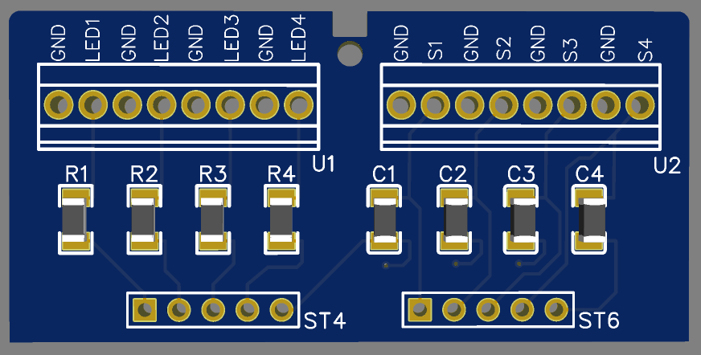

# HB_SW4_LED
Veränderte LED-Taster-Platine für Homematic HM-LC-Sw4-DR.

Die hier dargestellte Platine ermöglicht es von einem Homematic HM-LC-Sw4-DR die LED und Taster nach "außen" zu führen.
Dabei ist dann eine örtliche Anzeige / Bedienung nicht mehr vorgesehen.

Die Homematic HM-LC-Sw4-DR sind bei mir in einer Steckdosenleiste mit beleuchteten Tastern eingebaut.
In einem frühen Stadium wurden einfach auf der orginalen Platine die entsprechenden Pins mit einer Litzen vom Flachbandkabel abgegriffen.
Um die Anzeige und Bedienung einfacher an das Frontpanel der Steckdosenleiste zu bekommen 
habe ich diese Platine erstellt. 
Die U1 und U2 können z.B. mit DG308 2,54-8 oder anderen 8 poligen Klemmen im Rastermaß 2,54 mm bestückt werden.
ST4 und ST6 sind 5 polige gewinkelte Stiftleisten, die z.B. vom orginal Bausatz verwendet werden können.
(Leider ist hier auf dem 3D-Bild die falsche Einbaulage dargestellt. Die Stiftleisten müssen von der Rückseite montiert werden)

R1 bis R4 sind Widerstände 220 Ω/SMD/1206
C1 bis C4 sind Kondensatoren 100 nF/SMD/1206

